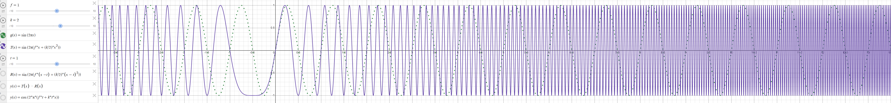
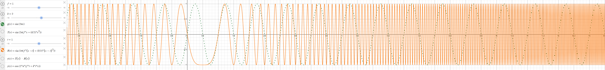
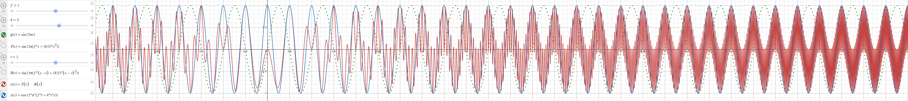
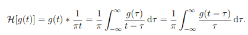

# FMCW Radar Tx/Rx Signal mixing and signal property acquisition

## FMCW Chirp Signals

### Transmitted Signal (TX)



The transmitted FMCW chirp is typically modeled as:
```
T(t) = sin(2 * pi * (f * t + (k / 2) * t^2))
```
- f = start frequency (Hz)  
- k = chirp slope (Hz/s)  
- t = time (s)  

The frequency increases linearly over time with slope **k** which can be calculated as followed:
```
k = (Fe - Fs) / Tc
```
- Fe = end fequency of the chirp (Hz)
- Fs = start frequency of the chirp (Hz)
- Tc = chirp duration (s)

---

### Received Signal (RX)


The received signal is a delayed version of the transmitted signal, due to the round-trip time delay **τ** from the target:
```
R(t) = sin(2 * pi * (f * (t - τ) + (k / 2) * (t - τ)^2 ))
```
- τ (tau) = time delay proportional to target distance (s)

---

### Mixing and Beat Frequency


#### Mixing Tx and Rx Signals
In an FMCW radar system, the **mixer** multiplies TX and RX signals:
```
y(x) = T(x) * R(t)
```
Using the trigonometric identity:
```
sin(a) * sin(b) = (1 / 2) * [cos(a - b) - cos(a + b)]
```
The product yields two components:

- **Difference frequency component** cos(a - b): contains the target range information  
- **Sum frequency component** cos(a + b): filtered out by low-pass filtering

The **beat frequency** f_b is approximately:
```
f_b = k * τ
```
which is proportional to the time delay **τ**.

---

#### Beat Signal Approximation
```
y(t) = cos ( 2 * pi * (f * τ + k * τ * t))
```
- The instantaneous beat frequency increases linearly with time, proportional to **τ**.  
- This frequency is used to calculate the distance **d** to the target:

```
d = (c * τ) / 2 = (c * f_b / (2 * k))
```

where **c** is the speed of light.

---

### Plotting Simulation 

- The **TX chirp** can be plotted as:

```
T(x) = sin(2 * pi * (f * x + (k / 2) * x^2))
```

- The **RX chirp** is the delayed version:

```
R(x) = sin(2 * pi * (f * (x - τ) + (k / 2 * (x - τ)^2))
```

- Simply plotting T(x) + R(x) shows interference but **does not model the radar beat frequency** correctly.

- The proper radar mixer output is the product:

```
Y(x) = T(x) * R(x)
```

This produces a **low-frequency envelope** corresponding to the beat signal.

---

### Why the frequency and phase are subtracted in (TI mmWave) radar documentation

- Mixing signals corresponds to multiplying their waveforms.
- This multiplication creates sum and difference frequencies.
- The difference frequency (subtraction of frequencies and phases) carries the range information.
- The sum frequency is removed by filtering.

---

### Audio example
[▶️ Download beat-chirp example](./Radar_Signal_Mixing_Audio_Example.mp3)
[▶️ Download audacity project](./Radar_Signal_Mixing_Audio_Example.aup3)

This is an audio demonstration as an analogy to the signal mixer functionality of the radar.
Two 3s linear chirps are generated:
- Start frequency of 440Hz
- Stop  frequency of 10KHz.

These frequencies and the 3s duration are chosen because of:

- Well within the hearing range of humans.
- A large frequency sweep in a short duration makes it a bit easier to see the linear chirp in the audacity plot.

#### Chirp vs beat frequency
In the audio example, 2 things are important to listen for:
- The overall **audio still sounds as a linear chirp** going up in frequency:
  
  This is because the **chirp frequency components** are **still present** in the envelope of the mixed signal.
  The linear chirp frequencies can be thought of as the carrier wave.
  These chirp frequency components (high frequencies) can be and will be filtered out in radar by using a Low Pass Filter.
  
- The **envelope of the mixed signal** represents the **Beat Frequency** of the mixed signal:
  
  Note that the **Beat Frequency** is a **Fixed frequency** , thus a **sinusoid** and not a chirp.
  Listen for a **slow oscillation** in the sound **amplitude** to recognize the **Beat Frequency**.
  Such a **Beat Frequency** can also be produced with mixing 2 sinusoids that are a couple of Hz apart as an intended **audio effect**.

---

### Hilbert transform
[The Hilbert Transform](https://www.comm.utoronto.ca/~frank/notes/hilbert.pdf)

The Hilbert transform shifts the phase of all frequency components of a real-valued signal by −90° (or +90°, depending on convention). 

It’s used to create what's called an analytic signal, which is a complex signal where:

- The real part is the original signal.
- The imaginary part is the Hilbert transform of the original signal.

Once the analytic signal is obtained, one can easily extract:

- Amplitude envelope (smooth "shape" of the waveform)
- Instantaneous phase
- Instantaneous frequency



```
H[g(t)] = g(t) * (1 / πt)                       => Note: '*' is convolution and not multiplication!
        = (1 / π) ∫_{-∞}^{∞} (g(τ) / (t - τ)) . dτ
        = (1 / π) ∫_{-∞}^{∞} (g(t - τ) / τ) . dτ
```

#### Analytic signal
For a real signal x(t), the analytic signal is:

```
z(t) = x(t) + j * x̂(t)  
```

Where:

- x̂(t) = is the Hilbert transform of the original signal x(t)
- j    = is the imaginary unit

So z(t) is a complex signal that lives in the complex plane.

Obtaining the instantaneous amplitude, frequency and phase from the analytic signal:

- Instantaneous amplitude:
```
A(t) = |z(t)| = sqrt(x(t)^2 + x̂(t)^2)
```

- Instantaneous frequency:
```
ϕ(t) = arg(z(t)) = tan^-1(x̂(t) / x(t))
```

- Instantaneous phase:
```
f(t) = (1 / 2π) . (dϕ(t) / dt)
```

---

## Summary Table

| Concept                 | Expression                                            | Physical Meaning                                             |
|-------------------------|-------------------------------------------------------|--------------------------------------------------------------|
| TX Signal               | sin(2 * pi * (f * t + (k / 2) * t^2))                 | Transmitted chirp with linear frequency increase             |
| RX Signal               | sin(2 * pi * (f * (t - τ) + (k / 2) * (t - τ)^2))     | Received delayed chirp                                       |
| Mixer Output            | T(t) * R(t)                                           | Product containing beat frequency                            |
| Beat Frequency          | f_b = k * τ                                           | Frequency proportional to target distance                    |
| Range Calculation       | d = (c * f_b) / (2 * k)                               | Distance to target                                           |
| Hilbert transform       | H[g(t)] = g(t) * (1 / πt)                             | Obtain the Hilbert transform of the original signal          | 
| Analytic signal         | z(t) = x(t) + j * x̂(t)                                | Obtain the analytic signal                                   |  
| Instantaneous amplitude | A(t) = \|z(t)\| = sqrt(x(t)^2 + x̂(t)^2)               | Extract the instantaneous amplitude from the analytic signal |  
| Instantaneous frequency | ϕ(t) = arg(z(t)) = tan^-1(x̂(t) / x(t))                | Extract the instantaneous frequency from the analytic signal |
| Instantaneous phase     | f(t) = (1 / 2π) . (dϕ(t) / dt)                        | Extract the instantaneous phase from the analytic signal     |

---
